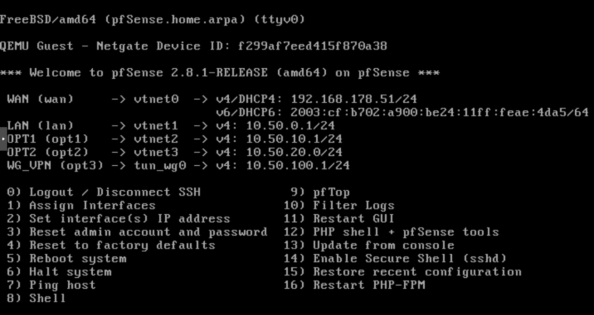
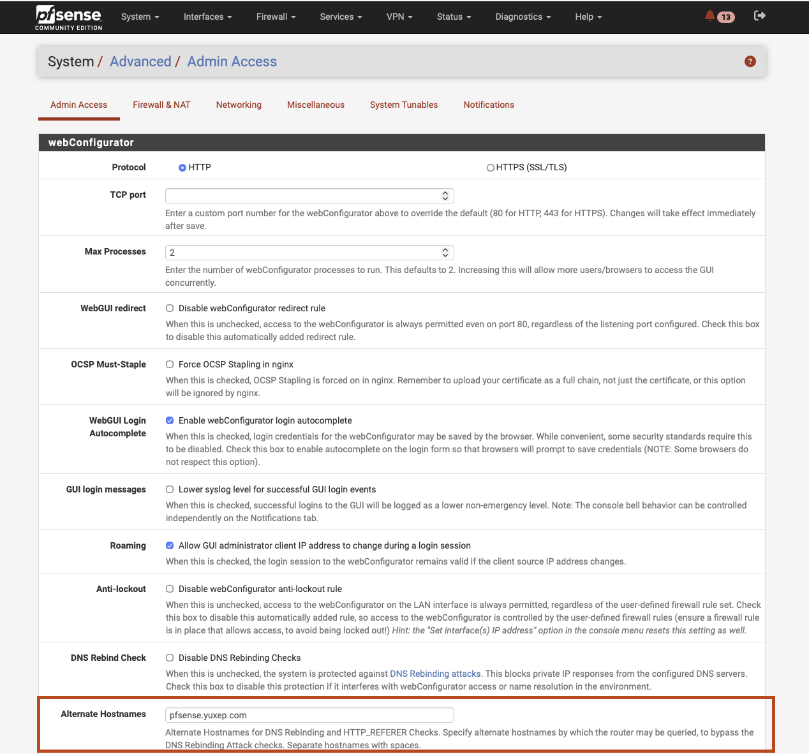
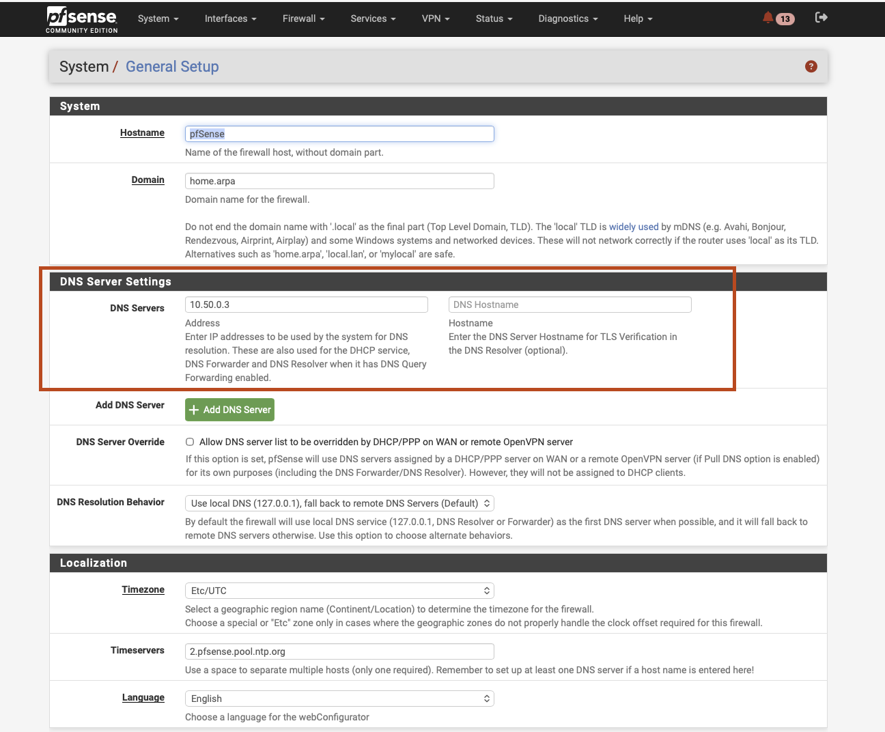

# pfSense Firewall Setup for Homelab

## Overview

This document describes the pfSense firewall setup for my homelab cluster.
pfSense runs as a virtual machine and is the central point for routing, inspection, and security policy enforcement.

All firewall and network configurations are done manually from the pfSense VM (console/WebGUI).
All traffic between homelab networks traverses through pfSense.

## Core Design

- pfSense is the network gateway between segmented homelab networks.
- Inter-network traffic is controlled with interface-specific firewall rules.
- Internal name resolution is handled through an internal DNS server.
- Remote access to private services is provided through WireGuard VPN.
- Kubernetes nodes and internal services are not exposed via public IPs.

## pfSense VM Console

Console snapshot details:

| Interface | Device | Address | Purpose |
| --- | --- | --- | --- |
| WAN | `vtnet0` | `192.168.178.51/24` (DHCP) | Upstream/home network connectivity |
| LAN | `vtnet1` | `10.50.0.1/24` | Main internal segment |
| OPT1 | `vtnet2` | `10.50.10.1/24` | Additional internal segment |
| OPT2 | `vtnet3` | `10.50.20.0/24` | Additional internal segment |
| WG_VPN | `tun_wg0` | `10.50.100.1/24` | WireGuard VPN network |

Environment:
- Version: `pfSense 2.8.1-RELEASE (amd64)`
- Deployment: `QEMU Guest` (pfSense VM)

## Admin Access: Alternate Hostname

Configured in `System > Advanced > Admin Access`.

Why this was done:
- To allow reliable WebGUI access using an alternate internal hostname.
- To align GUI access behavior with DNS rebinding protections.

## DNS Server Setup

Configured in `System > General Setup`.

In this setup, DNS server is set to `10.50.0.3`.

Why this was done:
- To use internal DNS for homelab hostname resolution.
- To keep internal service discovery consistent across network segments.
- To reduce dependency on public DNS for local traffic.
- To centralize DNS behavior for firewall and DHCP-managed clients.

## Firewall Rules

Firewall rules are managed manually and organized per interface:
`WAN`, `LAN`, `OPT1`, `OPT2`, and `WG_VPN`.

All east-west and north-south traffic between homelab segments traverses pfSense and is evaluated by these rules.

Rules are used to control:
- Inter-network access between homelab segments.
- Allowed inbound and outbound service ports.
- VPN traffic boundaries and permitted destinations.
- Default deny behavior until explicit pass rules are added.

## WireGuard VPN Setup

WireGuard is configured on pfSense to securely access the Kubernetes cluster and other internal nodes from WiFi/external networks.

Why this was done:
- To access private Kubernetes and internal services through an encrypted tunnel.
- To avoid exposing cluster nodes or internal services with public IPs.
- To enforce remote-access policy through pfSense firewall rules.
- To keep the internal network private while allowing secure administration.
