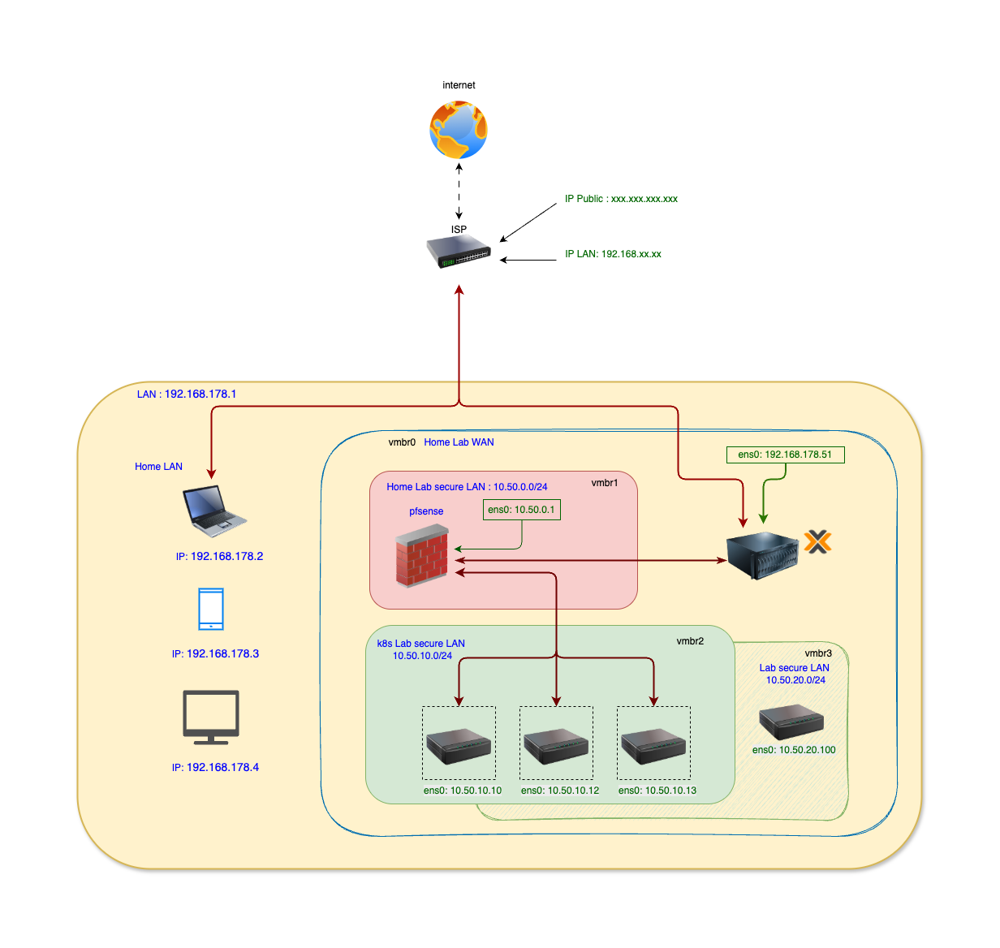
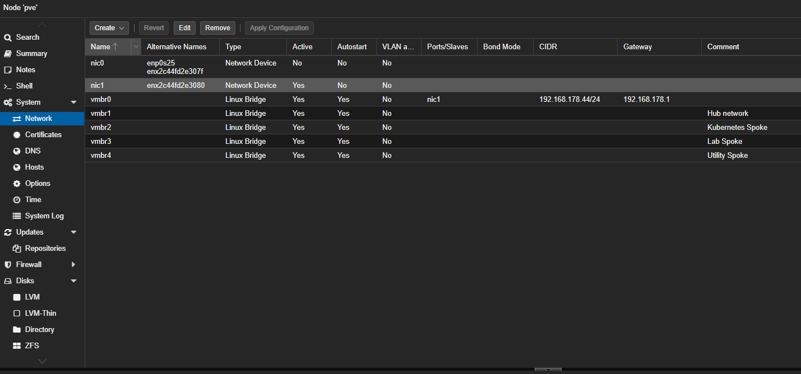

## 🗺 Lab Network Design (Proxmox)



Reference source: see `ProxomoxNetworkRoute.drawio` in this folder. Export the diagram to `ProxomoxNetworkRoute.png` to update the embedded image.

Perfect — your **bridge layout is correct**, and now we’ll lock in a **clean, enterprise-style IP plan** that matches exactly what you’ve built in Proxmox.

I’ll do this in **3 layers**:

1. IP ranges per network (CIDR plan)
2. Gateway & DHCP strategy
3. Final **IP allocation table** (what you asked for)

---

## 1️⃣ Final IP Ranges (v2.1 — current)

> **Updated to match the deployed architecture.**
> The old hub-spoke design (vmbr1–vmbr4 / 10.50.x.x) has been replaced with a
> flat-segment design managed by OPNsense.

| Proxmox Bridge | Purpose            | CIDR                 | Status        |
| -------------- | ------------------ | -------------------- | ------------- |
| vmbr0          | WAN — home router  | `192.168.178.0/24`   | ✅ Physical NIC (enx2c44fd2e3080) |
| vmbr1          | K8s private LAN    | `10.10.10.0/24`      | ✅ Active      |
| vmbr2          | SIEM lab           | `10.10.20.0/24`      | 🔜 Reserved (no VMs yet) |
| vmbr-mgmt      | Management         | `10.10.99.0/24`      | ✅ Active      |

✅ OPNsense owns all gateways (`.1` per segment)
✅ Clean trust-zone separation enforced by firewall rules
✅ All internal bridges are internal-only (no physical NIC on vmbr1/vmbr2/vmbr-mgmt)

---

## 2️⃣ Gateway & DHCP Strategy

**Rule:**
👉 *Proxmox bridges have NO IPs assigned*
👉 *OPNsense owns all gateways*

Each network’s **`.1` address = OPNsense interface**

| Network    | Interface    | Gateway       |
| ---------- | ------------ | ------------- |
| WAN        | vtnet0       | `192.168.178.1` (home router) |
| K8s LAN    | vtnet1 (LAN) | `10.10.10.1`  |
| SIEM lab   | vtnet2 (OPT1)| `10.10.20.1`  |
| Management | vtnet3 (OPT2)| `10.10.99.1`  |

DHCP:
* **K8s LAN (vmbr1)** — OPNsense DHCP; K8s nodes use static assignments
* **SIEM lab (vmbr2)** — DHCP reserved for future use
* **Management (vmbr-mgmt)** — **Static IPs only** (no DHCP on OPT2)

---

## 3️⃣ IP Allocation Table (v2.1 — Authoritative Plan)

---

### 🌍 WAN – vmbr0 (`192.168.178.0/24`)

> Physical NIC: `enx2c44fd2e3080`. Not managed by Terraform — configured on Proxmox host directly.

| Component       | IP                            |
| --------------- | ----------------------------- |
| Home Router     | `192.168.178.1`               |
| Proxmox Host    | `192.168.178.44`              |
| OPNsense WAN    | DHCP (e.g. `192.168.178.50`)  |

---

### ☸️ Kubernetes LAN – vmbr1 (`10.10.10.0/24`)

| Component          | IP              |
| ------------------ | --------------- |
| OPNsense LAN (vtnet1) | `10.10.10.1` |
| Pi-hole DNS        | `10.10.10.2`    |
| K3s Control Plane  | `10.10.10.10`   |
| K3s Worker 1       | `10.10.10.11`   |
| K3s Worker 2       | `10.10.10.12`   |
| MetalLB Pool       | `10.50.10.100/32` |

📌 **K8s internal ranges — do NOT overlap:**
```
Pod CIDR:     10.42.0.0/16
Service CIDR: 10.43.0.0/16
```

---

### 🧪 SIEM Lab – vmbr2 (`10.10.20.0/24`) — 🔜 Reserved

| Component              | IP              |
| ---------------------- | --------------- |
| OPNsense OPT1 (vtnet2) | `10.10.20.1`    |
| Wazuh Manager          | `10.10.20.10`   *(future)* |
| Log Collector VM       | `10.10.20.11`   *(future)* |

🔒 Isolated from vmbr1 via OPNsense firewall rules (`vmbr1 ↔ vmbr2` BLOCKED).

---

### 🛠 Management – vmbr-mgmt (`10.10.99.0/24`)

| Component                  | IP              |
| -------------------------- | --------------- |
| OPNsense OPT2 (vtnet3)     | `10.10.99.1`    |
| Tailscale Subnet Router    | `10.10.99.10`   |
| Proxmox Backup Server (PBS)| `10.10.99.20`   |
| Bastion VM (break-glass)   | `10.10.99.30`   |

🔒 **LAN/OPT1 → MGMT: BLOCKED.** MGMT → all: ALLOWED + NAT via OPNsense OPT2.

---

## 4️⃣ Why this design is correct

* ✔ OPNsense owns all gateways — single choke point for firewall + IDS/IPS (Suricata)
* ✔ One gateway per segment — clean trust-zone separation
* ✔ Management plane isolated — LAN/SIEM cannot reach MGMT
* ✔ Tailscale subnet router on MGMT bridge — advertises all private subnets remotely
* ✔ SIEM-friendly — all inter-segment traffic transits OPNsense (NetFlow, syslog, Suricata)
* ✔ Zero inbound ports — public apps exposed via Cloudflare Tunnel (outbound-only)

---
## 📸 Proxmox network implementation


