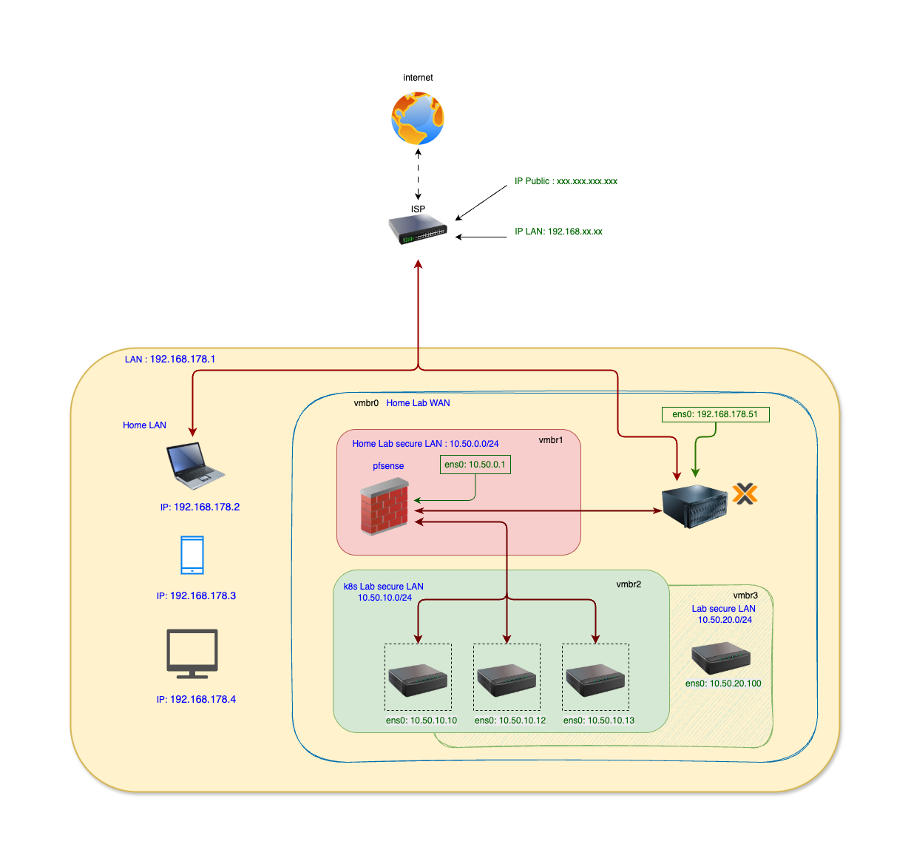

## 🗺 Lab Network Design (Proxmox)



Reference source: see `ProxomoxNetworkRoute.drawio` in this folder. Export the diagram to `ProxomoxNetworkRoute.png` to update the embedded image.

Perfect — your **bridge layout is correct**, and now we’ll lock in a **clean, enterprise-style IP plan** that matches exactly what you’ve built in Proxmox.

I’ll do this in **3 layers**:

1. IP ranges per network (CIDR plan)
2. Gateway & DHCP strategy
3. Final **IP allocation table** (what you asked for)

---

## 1️⃣ Final IP Ranges (aligned with your bridges)

You currently have **4 internal networks + WAN**.
We’ll use **non-overlapping /24s** (best practice).

| Proxmox Bridge | Purpose               | CIDR               |
| -------------- | --------------------- | ------------------ |
| vmbr0          | WAN (Home network)    | `192.168.178.0/24` |
| vmbr1          | Hub Network           | `10.50.0.0/24`     |
| vmbr2          | Kubernetes Spoke      | `10.50.10.0/24`    |
| vmbr3          | Lab Spoke             | `10.50.20.0/24`    |
| vmbr4          | Utility / Tools Spoke | `10.50.30.0/24`    |

✅ Clean
✅ Easy to remember
✅ Scales later (vmbr5 → 10.50.40.0/24)

---

## 2️⃣ Gateway & DHCP Strategy (IMPORTANT)

**Rule:**
👉 *Proxmox bridges get NO IPs*
👉 *pfSense owns all gateways*

Each network’s **`.1` address = pfSense interface**

| Network | Gateway      |
| ------- | ------------ |
| Hub     | `10.50.0.1`  |
| K8s     | `10.50.10.1` |
| Lab     | `10.50.20.1` |
| Utility | `10.50.30.1` |

DHCP:

* Enable **DHCP on pfSense**
* Disable DHCP everywhere else

---

## 3️⃣ IP Allocation Table (Authoritative Plan)

This is the table you can **save as project documentation**.

---

### 🌍 WAN – vmbr0 (Already configured)

| Component    | IP                           |
| ------------ | ---------------------------- |
| Home Router  | `192.168.178.1`              |
| Proxmox Host | `192.168.178.44`             |
| pfSense WAN  | DHCP (e.g. `192.168.178.50`) |

---

### 🧠 HUB Network – vmbr1 (`10.50.0.0/24`)

| Component           | IP                |
| ------------------- | ----------------- |
| pfSense (Hub iface) | `10.50.0.1`       |
| DNS Server          | `10.50.0.10`      |
| SIEM / Syslog       | `10.50.0.20`      |
| Jump / Admin VM     | `10.50.0.30`      |
| Reserved            | `10.50.0.100–200` |

---

### ☸️ Kubernetes Spoke – vmbr2 (`10.50.10.0/24`)

| Component            | IP                 |
| -------------------- | ------------------ |
| pfSense (K8s iface)  | `10.50.10.1`       |
| k3s Control Plane    | `10.50.10.10`      |
| Worker Node 1        | `10.50.10.11`      |
| Worker Node 2        | `10.50.10.12`      |
| MetalLB Pool (later) | `10.50.10.200–220` |

📌 **Important (K8s internal ranges – do NOT overlap):**

```
Pod CIDR:     10.42.0.0/16
```

---

### 🧪 Lab Spoke – vmbr3 (`10.50.20.0/24`)

| Component             | IP            |
| --------------------- | ------------- |
| pfSense (Lab iface)   | `10.50.20.1`  |
| Kali Linux            | `10.50.20.10` |
| Victim VM             | `10.50.20.11` |
| IDS Sensor (optional) | `10.50.20.20` |

🔥 Perfect for attack & detection labs

---

### 🛠 Utility / Tools Spoke – vmbr4 (`10.50.30.0/24`)

| Component               | IP            |
| ----------------------- | ------------- |
| pfSense (Utility iface) | `10.50.30.1`  |
| Terraform VM            | `10.50.30.10` |
| Git / CI                | `10.50.30.11` |
| Monitoring Tools        | `10.50.30.20` |

---

## 4️⃣ Why this design is CORRECT (important for confidence)

* ✔ Matches Azure Hub-Spoke VNets
* ✔ One gateway per spoke
* ✔ Clean separation of trust zones
* ✔ Easy firewall rule writing
* ✔ SIEM-friendly (all traffic through pfSense)

---
## 📸 Proxmox network implementation


